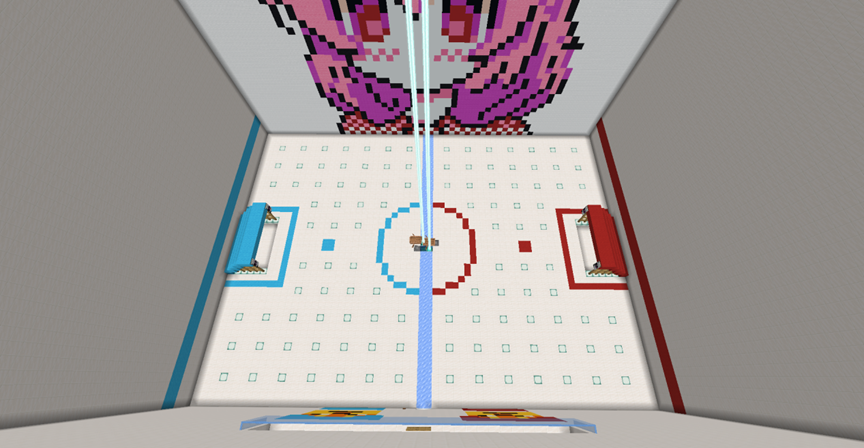

# 冰球比赛规则1.2版
在梦幻之屿服务器中进行视频创作，会获得一定量的奖励。这是一项长期活动，

## 冰球比赛原理特性

利用空岛岛屿规则特性，比赛岛屿仅开放，不给予选手信任权限，在此条件下，选手可以通过击退2的剑对船造成击退，这便是冰球比赛最核心的原理。在这种情况下，选手之间无法pvp，举起玩家，无法破坏场地，仅仅只能靠击退船来进行活动，确保了公平公正。比赛允许观赛，但要在观赛区进行观赛，视野不好的观众可以运用灵魂出窍来观赛，比赛期间观众席提供免费食物，不必担心饿肚子awa！包括比赛队伍也免费提供食物~

## 游戏规则
1.	冰球比赛主要为淘汰赛进行选拔获胜队伍，但不排除进行一些特殊的比赛，诸如友谊赛，复活赛等其他比赛，其他类型的比赛将在后续经过社团成员研究决定是否举行。
2.	常规比赛采用限时和计分进行判断输赢，同时场上有至少1-2个裁判，裁判身着黄色衣服，便于判断裁判人员，裁判只要不干预比赛，可以自由选择位置，如果裁判意外干扰比赛，则重新发球。裁判多次在场上干扰比赛，比赛队伍可以申请更换裁判。
3.	禁止打假赛，诸如遇见熟人队伍故意放水，互相提前串通等，如有发现，直接取消整队本次比赛资格。
4.	比赛过程禁止恶心比赛选手包括裁判，观众，参赛队员，参赛队员如有违此规一次罚球，二次取消本次比赛资格，裁判出现此情况，更换裁判并且批评教育，观众或者无关人员以及以上人员出现此情况，同时按照服务器规定处理。
5.	禁止使用任何连点类作弊功能诸如ac，dc，jc，震动棒，鼠标中键滚轮等能提升点击速度的方式，仅允许平点，一次犯规罚球一次二次犯规取消本次比赛资格，同时也禁止饮用药水，饮用药水，会直接取消本次比赛资格（类似于兴奋剂这样的东西在奥运会也是明令禁止的哦）。如果存在其他作弊行为或者严重影响比赛平衡性的情况，裁判可按照场上实际情况处理，决定是否罚球或取消比赛资格。
6.	进行淘汰赛时，比赛顺序抽签决定，可能存在奇数队伍轮空的情况。如果存在队员迟迟未能到场的情况，可以选择直接开始比赛，或者放弃本场比赛，放弃比赛则判负。如存在其他违规情况，依据实际情况裁决。
7.	比赛场地位于Star_falls，一只队伍人数上限为5人，需要一名队长，作为对接举办方和向球员传达信息，领取队长奖励等事件的人员，四名球员，同时取队名上报给活动社团珊瑚宫成员进行登记。队伍人数不足时（至少3人，你认为人少还能赢也可以），比赛队伍数量无上限，但不少于两支队伍。
8.	常规比赛时间30分钟，比赛目标是将船打入对方球门（船进入凹槽内或门内栅栏边），时间结束时，计分高的队伍获胜，如果存在平分，则进入加时赛，直到一方打破平分结束，不过这可能存在时间较长的情况，允许弃赛，弃赛判负。
9.	比赛过程中，两只队伍穿上队服，使用统一提供的击退2木剑来进行比赛，木剑仅用于击退船。冰球场地如图所示（仅供参考，实际场地可能有细微调整）

左边为蓝队，右边为红队，两边为门框，下面的两个门为队员准备室。比赛场地中间的圆是在发球时，双方队员不可进入的区域，而双方队员此时不能跨过中线（浮冰），由裁判进行发球。门线作为罚球时的特殊用途。圆和门线中间的点为罚球点，发生需要罚球的情况时，双方普通队员站在罚球的一方不能越线，被罚球方选取一人在门线内，罚球方选取一人在罚球点进行击球（球放在点上，在罚球方击球之前，被罚球方不能攻击球）。如果出现球（船）卡住或者损坏情况，将重新开球。
10.	比赛过程中战术战法由双方自行研究探讨，但是禁止出现所有人都站在球门里挡住球进入球门的行为，或者蓄意干扰比赛正常进行的存在，具体情况具体评判。
## 比赛观赛，奖励，裁判等其他说明：
1.	比赛裁判为珊瑚宫社团全体社员，周普通赛时至少1名裁判以上在场即可开始比赛，国庆淘汰赛至少2名裁判以上在场。将会允许观众在观众席观赛，并且可以合理提出建议。禁止观众干扰比赛，严重干扰比赛者将可能会被踢出岛屿甚至踢出服务器。
2.	比赛安排情况如下：
      普通周末常规赛(九月）（周六晚8点），每周比赛1场，（视情况增加比赛次数或者暂时不进行比赛，比赛前至少1天会通知）常规赛每队依旧3-5人，需要队长。常规赛依旧是30分钟一场，存在加时赛，但常规赛仅2只队伍进行比赛。获胜队伍每人将获得信标x1，纪念品：鸡腿棒子x1，周赛失败队伍奖励纪念品：鸡腿棒子x1。
      国庆节淘汰赛，30分钟一局，存在加时赛。（10月4日下午2点开始淘汰赛初赛，根据队伍数量决定是否有后续赛程，例如国庆节淘汰赛有2只队伍，那么仅赛一场决定胜负，如果有4只队伍，或者是更多队伍，将开启抽签决定对手或者轮空的情况，例如8只队伍，4场比赛，获胜的再进行2场比赛，最终赛出2只获胜队伍，在当日晚上8点进行决赛。最终第一名冠军队伍队员将会获得信标x1，和纪念品：鸡腿棒子x1，队长获得鞘翅x1和纪念品：鸡腿棒子x1。第二名亚军队伍全队获得海洋之心x1和纪念品：鸡腿棒子x1，剩下的参赛队伍成员每人获得纪念品:鸡腿棒子x1
      比赛可能将不只是存在于九月和十月国庆节，有可能在后续进行更多届比赛以及其他类型的冰球比赛，届时将会提前通知。
      3.报名时间：
      常规赛每周赛前4小时前报名截止。队伍人数3-5人，推荐5人
      国庆节淘汰赛即日起开始报名，直到10月2日晚23点59分前截止。
      赛前1天内公布比赛顺序抽签结果。
      报名渠道：
      可向珊瑚宫全体成员报名，推荐报名联系人：bai_lu_yu_ge,Star_falls，lixiaoshuai008。其他珊瑚宫成员可能在线时间较少，较难取得联系。报名请选取一名队长作为接头人，方便及时沟通联系。
      或者你也可以选择填写在线表格报名，按照表格内容填写完整。
      如果有需要，将会建立qq群方便进行沟通。
      最后，如果有不清楚不明白的可以咨询珊瑚宫社团成员。

## 附件
鸡腿棒子指令
/give @p minecraft:blaze_rod{display:{Name:"[{\"text\":\"鸡腿棒子\",\"color\":\"gold\",\"bold\":true,\"italic\":false,\"underlined\":false,\"strikethrough\":false,\"obfuscated\":false}]",Lore:["{\"text\":\"2021年冰球比赛常规赛/国庆淘汰赛纪念品\",\"color\":\"aqua\",\"bold\":false,\"italic\":false,\"underlined\":false,\"strikethrough\":false,\"obfuscated\":false}","{\"text\":\"作为冰球比赛种子选手，纪念品是最好的实力证明~\",\"color\":\"white\",\"bold\":false,\"italic\":false,\"underlined\":false,\"strikethrough\":false,\"obfuscated\":false}"]}} 1
## 群公告内容
冰球比赛活动进行中
想要在空岛生存里获得一些乐趣？想要获得一些难以获得的物品？
那么冰球比赛将是你的最佳选择！比赛将有信标，纪念品，鞘翅奖励，详情查看比赛文件。
冰球比赛现在即将开始！详细规则请阅读群文件内容~
比赛时间：
常规赛：九月份每周六晚八点，每周一场（根据当时实际情况，可能有一些变动，变动将会提前通知）
国庆节淘汰赛：10月4日下午2点初赛，晚上8点决赛。（考虑到之前有空岛战争活动）
报名时间：
常规赛每周赛前4小时前报名截止。队伍人数3-5人，推荐5人
国庆节淘汰赛即日起开始报名，直到10月2日晚23点59分前截止。
赛前前一天公布比赛顺序和比赛队伍抽签结果。
同时有必要的情况下将会建立qq群，方便统计人员和通知。
报名渠道：
1.	可向珊瑚宫全体成员报名，推荐报名联系人：bai_lu_yu_ge,Star_falls，lixiaoshuai008。其他珊瑚宫成员可能在线时间较少，较难取得联系。报名请选取一名队长作为接头人，方便及时沟通联系。
2.	填写在线表格报名，按照表格内容填写完整。
      比赛有一定的随机性，也可能存在不可抗力因素导致比赛推迟或取消，请提前做好一定准备哦！耐受能力较差的不建议参与比赛，比赛时间较长，时间上有冲突的也不建议参加，如果冲突的情况较多则可能考虑变更比赛时间。

