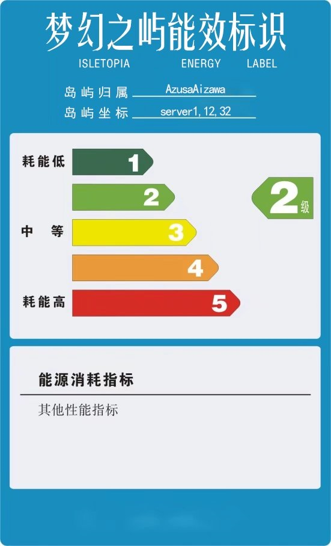

::: danger
该网站已过期，大部分信息都是过时的，请加入QQ频道，或以游戏内特性为准。
:::

# 特色岛屿系统

::: tip 这是什么
梦幻之屿具有独特的岛屿系统，该岛屿系统插件由梦幻之屿管理组自主研发，不参照市面上任何一款空岛插件。能够精细控制服务器的每一处细节，实现服务器最初的设计理念。

岛屿系统包括以下几个方面内容：多岛合作制、多区负载均衡、自由生物群系、岛屿独立备份、岛屿能效限制、原版内容轻改。
:::

## 多岛合作制
不同于传统空岛插件，在梦幻之屿中每个玩家可以拥有多个岛屿，每个岛屿拥有不同的生物群系。

玩家可以添加其他人为自己的岛屿成员，共同合作创造岛屿。

使用`/is help`指令可查看权限管理相关指令。

::: tip 正版用户
此服务器为正版服，你可以放心更改自己的ID。服务器底层采用UUID鉴别玩家身份，更换ID后仍然保留所有数据。
:::

## 多区负载均衡
众所周知，Minecraft服务器无法充分利用多核性能，并且来到高版本后，服务器性能优化越来越差。在不做某些严重影响游戏体验的“优化”下，单端能带的人数甚至不超过10人。

::: details 通常所说的“优化”做了哪些事情?为什么不能“优化”？

通过一些”优化“手段，可以让高版本单端服务器带40以上的人数，而这些真的是优化吗？为什么专注于性能优化与漏洞修复的Paper服务端不默采用这些设置呢？

其实，对于生存服务器而言，这些优化手段会严重影响正常游戏体验。

首先是，“优化”最常做的，调低服务器视距，而这对红石与建筑是毁灭性打击。对于部分稍大的建筑，服务器默认10的视距都难以看到全貌，很难想象调低到5甚至更低的情况下，如何观看建筑。在跑图时，那更是难以忍受的糟糕体验。

其次是刷怪，通过一些设置可以降低怪物的刷新速度，甚至降低怪物寻路范围。实体运算与寻路是服务器性能消耗最大的一部分，这样的设置能够显著降低服务器mspt。但这，让AI本就显得不太聪明的怪物雪上加霜，即使服务器是困难模式，怪物对玩家几乎没有威胁，同时刷怪塔效率大大降低，产量大幅下降。

对于RPG或小游戏服务器，其实是没有什么影响的。而对于生存服务器而言，这些“优化”，是以阉割游戏内容为前提的，而这为大部分玩家不能接受。

:::

梦幻之屿将玩家分布在12个镜像空岛服务器中，新玩家进入服务器时，将玩家的岛屿分布到负载最低的子服中。通过这样的方式，能够有效利用多核性能。我们能够确保，在服务器内80个岛同时允许基础机器（刷怪塔、刷石机、熔炉组）时，服务器不会掉刻。作为一个公益小服，做到这一步，已经是我们的极限。

::: details 空岛服务器占用的资源少所以不卡？

这个观点是完全错误的，对于原版空岛服务器，占用的服务器资源比原版生存要高得多得多。在生存/生电服务器中，存在大量玩家共享同一种机器的情况，且玩家通常聚集在相同的区块中而空岛服务器玩的就是从无到有的过程，对于同一种机器几乎每个岛都有一份，例如最常见的刷石机、树场、刷怪塔、交易所、刷铁场，每个岛必备。同样配置下，空岛服务器能够带的人数要比生存/生电服务器少得多。但空岛服务器的优势在于，岛屿之间相互独立，可以进行多子服负载均衡。

:::

目前市面上很少见到大型高版本服务器，这也不仅仅是因为MC服务器难以利用多核性能了，而是因为：**即使MC服务器能充分利用多核性能，也支撑不了多少玩家了。** 目前高版本服务器的优化，已经不单是一个“差”字来形容了。

用过去千人服的配置，而如今供几十人游玩偶尔都难堪负重。服务器的未来发展着实令人堪忧。

梦幻之屿将尽自己所能，维护好一个小服。

## 自由生物群系

服务器允许玩家自由切换生物群系。

通过切换下界、末地生物群系，可以刷新相应的下届、末地生物。

为了让事情变得容易掌握，每个岛只有一种生物群系，如果你需要多种生物群系，请使用多个岛屿。

请通过输入`/is setBiome`修改你的岛屿生物群戏。

对于MC原版的八十多种生物群系，你都可以自由切换，通过切换这些生物群系，你几乎可以刷出原版生存中所有的生物。

::: tip 提示
自由生物群系是梦幻之屿非常重要的特性，有了自由的生物群系，不同的岛屿也开始了分工合作。有的岛是海洋，有的岛是下界，有的岛是蘑菇岛，一个个奇妙而又各不相同的岛屿就此诞生。
:::

## 岛屿独立备份

如果你了解MC存档的文件格式就应该清楚，存档中有关地形的存储是按照512x512（也就是32x32个区块）进行的，梦幻之屿的岛屿恰好是512x512。梦幻之屿的每个岛屿都与存档文件对齐，所以备份工作非常容易进行。

服务器每隔10分钟会备份一次在线玩家脚下的岛屿，服务器可以按照岛来进行回档，无需全服回档，所以你根本不用担心自己的岛会出现什么奇奇怪怪的问题。但由于MC区块加载的机制比较诡异，目前仍然没有研究出热回档的方法。回档需要重启服务器，但这就比较麻烦了，服务器遵循非必要不回档的原则。
:::warning 注意
除非你的岛是由于服务器原因被破坏，原则上不提供回档功能。
:::

## 岛屿能效限制

再好的优化与再强的硬件也架不住机器暴力堆叠与浪费，为了杜绝浪费现象，我们独立开发了负载机制。

梦幻之屿根据岛屿对当前所在“区”的MSPT贡献计算当前岛屿的能耗等级。耗能等级分为5级，从1级到5级。
根据区当前负载状况，耗能等级越高的岛屿会受到越严格的开放限制。
不满足开放条件的岛屿，将无法进入与加载。每个岛屿单独计算负载。

::: details 什么是负载？负载是如何计算的？

在梦幻之屿，岛屿负载即岛屿运算所占用的真实MSPT。

Minecraft服务端每50毫秒进行一次Tick运算，如果服务器在上一个Tick中产生的更新不能在这次Tick的50毫秒中完成，就会产生“延迟”。
单次Tick运算时间称为MSPT，我们通常用它代指最近的平均MSPT。由此可知，MSPT在严格小于50时，游戏不会产生任何延时，玩家游戏感知完全相同。

由上述可知，在理想状态下，服务器每秒将进行20次Tick运算，而在非理想状态下，服务器被迫只能减少每秒的Tick次数。
服务器最近每秒进行的Tick次数我们通常称为TPS，TPS是一个平均值。
TPS>18时，玩家不会明显感受到延迟；
当TPS处于15~18时，玩家将能明显感知到延迟；当TPS小于15时，游戏几乎无法进行。

而在Minecraft中，运算主要来源于：
a. 实体AI计算（寻路、行为等）
b. 实体生成（刷怪）
c. 类实体方块（漏斗、活塞、水、农作物等）
d. 区块加载与保存
e. 其他

由于d和e不方便统计，我们在计算负载时只计算前三个，通常前三个也是主要的负载来源，我们将根据玩家岛屿对MSPT的贡献来给岛屿进行耗能分级。

玩家岛屿的MSPT贡献=a+b+c

由上述公式可以看出，岛屿MSPT贡献一定程度上反映了岛屿的“卡顿”状况。但是由于统计不完全，玩家岛屿实际MSPT高于统计数据。

:::

我们将根据岛屿的周期内最大贡献值来确定岛屿的耗能等级， 每个岛屿每1小时将获得一次降级重新评级的机会。
即，若当前岛屿耗能小于当前耗能等级，则降低一级。重启则完全重置等级。重新评级的机会会在可用时自动触发。

我们进行如下分级：
0~2：一级能效
2~5：二级能效
5-10：三级能效
10-15：四级能效
15-25：五级能效
25+：六级能效

对于一级、二级、三级能效岛屿，我们通常不会干预岛屿的加载。

对于四级能效岛屿，岛屿将在所在区MSPT>70时被禁止加载。
对于五级能效岛屿，岛屿将在所在区MSPT>50时被禁止加载。
六级岛屿无论在任何情况都无法访问

岛屿评级采用置信度分析法，每10秒都会对岛屿进行一次抽样评级，根据MSPT贡献值调整评级自信度，当自信度达到100时，更改玩家岛屿的能效等级，通常会在30秒内完成评级。

::: details 岛屿负载机制会对玩家产生多大的限制？

可以肯定的说，对绝大部分玩家来说，不会有任何限制，甚至是一种保护。从加载条件可以看出，在全区不掉刻的情况下，单个岛屿最高可占用全区50%的性能，
在最差的情况下（MSPT>70），单个岛屿也至少能使用30%的性能。如果在这种情况下仍然不能承载的红石机器，那即使毫无限制情况也不会好到哪里去。

此外由于多区的架构，玩家可以避开高负载区服，尽可能避免单个高负载岛屿对其他玩家产生的影响。
:::

## 原版内容轻改

Mojang设计这款游戏从来都没有考虑过空岛模式，这是理所应当的。所以作为一个公开的服务器，我们也需要对一些不适合空岛服务器的原版机制进行修改。

你可以在玩家手册中找到这些修改的具体内容，服务器对原版机制尽可能保持尊重，只做加法不做减法（bug除外）。所以你可以尽情使用在原版生存中的所有技巧，同时也不要忘了深入了解服务器的特殊机制，这会支持你更好地玩下去。

除了一些轻微改动外，服务器还提供了一些特殊机制，这些特殊机制通常是独立于原版内容之外的。大多是为了有趣才让它们加入，如果不喜欢，你完全可以可以不使用这些机制，它们通常不会有太大影响。

## 化繁为简的设计理念

梦幻之屿岛屿特色系统始终以化繁为简为设计理念。把复杂的事情变简单，让玩家专注于游戏内容本身。

梦幻之屿没有主城，也不提供任何系统建筑，没有创建岛屿的过程，进入服务器即开始游戏。梦幻之屿就是一个纯粹到不能再纯粹的空岛生存服务器，除了空岛，那就什么也没有了。

除此之外，在游戏实际过程中，你会发现这一理念贯穿整个服务器设计。
