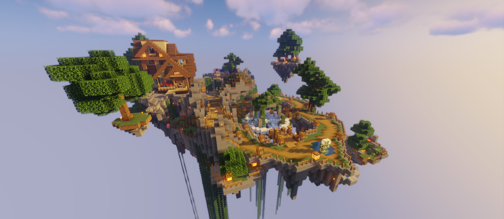
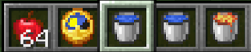
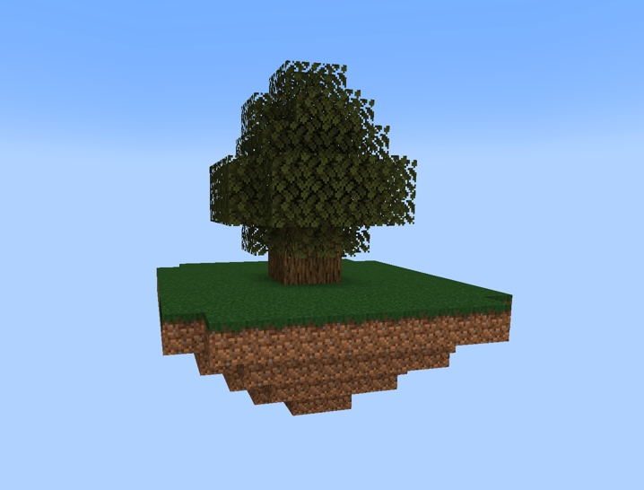
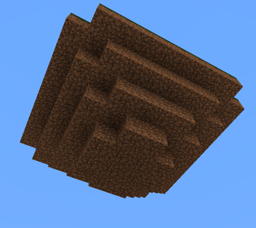
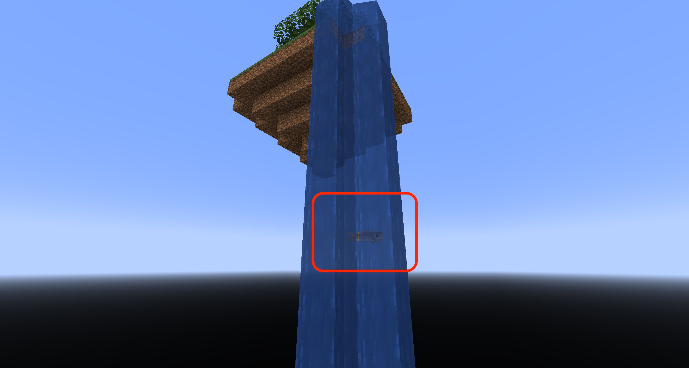
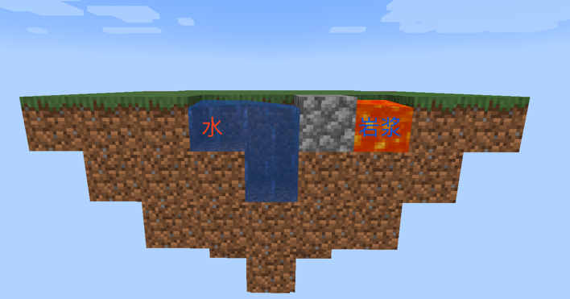
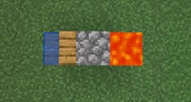

# 新手教学——空岛从入门到精通

::: warning 注意

此教程由`Molean`编写，其能力有限，可能会出现错误，并且包含一定主观看法。请根据自身所需进行学习。

!该教程正在施工中。。

:::

## 0.确定目标

在教学正式开始前，先聊聊这款游戏以及服务器的定位。

了解到梦幻之屿空岛服的玩家，大部分都对MC原版内容有一定了解，或多或少对红石或建筑有一定的兴趣，但对红石或建筑的掌握程度也仅仅处于初步状态。 梦幻之屿目标玩家正是这样的，面向进阶型玩家，有一定原版基础，但又没有达到精通水平。往上，有更加专业的生电、建筑服务器。往下，有轻松愉快的原版陆地生存。

梦幻之屿尽最大所能，为玩家提供一个不受限制、接近原版的红石空岛环境，一个和谐友善富有生机的社区，一群创意无限热爱游戏的岛友。

在梦幻之屿，你能学到什么、玩到什么？ 答案很明显：
- 钻研原版游戏机制
- 团队项目工程设计
- 掌握原版空岛发展流程
- 广泛涉猎各种类型的红石机械
- 物品生产自动化
- 中小型生存建筑设计

更进一步，服务器定期举办活动，你还能玩到与学到：
- 地图画、像素画、雕塑设计
- 原版极限、超极限生存
- 空岛战争、解密游戏、冰球比赛等

梦幻之屿不会给玩家派遣任务或成就。但如果实在不知道应该做什么，就以建造一个美丽宜居的岛屿为目标吧！

## 1.基础介绍——了解空岛

### 1.1.初始物品

首先进入服务器后，你会得到以下物品。

`苹果x64`   提供前期基础食物，你必须在吃完之前找到食物来源。(重生不回饱食度)

`水桶x2`    提供水源，两个水即可制作无限水。

`岩浆桶x1`  与水结合无限生成圆石，是无中生有的开始。

`菜单x1`    服务器相关功能，协助记忆指令，无太大意义，可直接丢弃。

### 1.2.初始岛屿

初始岛屿上会生成一颗较大的橡树，挖掉它可以获得一定数量的橡木和树苗。记得及时补种树苗，以获得更多木头。

在橡树下有一个泥土平台，它是锥形的，并不是长方体。

泥土平台表面是草方块，草方块一个基本的特性就是会向周围的泥土上蔓延，这是新增草方块的唯一方法。所以你至少要保留一个草方块供后续使用。

### 1.3.无限水的制作

水是非常重要的，可用于制作刷怪塔和刷石机。利用MC原版特性，两桶水就可以生成无限多的水。

第一种方法： 挖一个1x3的坑，然后在两端倒上水，你就可以从中间那格水中无限获取水。

第二种方法(推荐)： 挖一个2x2的正方形，在正方形的两个对角放上水。

### 1.4.不稳定的食物来源

如果你是新手玩家，折腾了半天可能食物储备已经见底了。

试试在岛屿边缘放上一桶水，耐心等待水流流向虚空，顺着水流游下去，你会发现水中有一些鱼。这可以作为前期获取食物的方法。

也可以试试种植橡木，橡树树叶有概率掉落苹果。

## 2.手动刷石机——从零开始无中生有

利用刷石机，我们可以获取大量圆石。使用圆石可以烧制其他方块，也可以用于扩建岛屿，同时，也是建造刷怪塔的必要材料。

### 2.1.最基础的手动刷石机

挖一个1x4的坑，在第二格位置挖深一格，在第一格放水，第四格放岩浆。第三格即可源源不断生成圆石。

该结构刨面图如下。记住，实际操作时水和岩浆的侧边是需要方块阻挡的。

### 2.2.同样基础但优雅的手动刷石机

同样是基础刷石机，但利用了高版本含水方块的特性。挖1x3的坑，第一格放入楼梯，楼梯背靠第二格，第三格放入岩浆。第二格即可无限刷出圆石。

## 3.刷怪塔——资源获取的重要场所

### 3.1.必要工作

在建造刷怪塔之前，请先确保自己已经获取了至少4组圆石。你不可以使用木头替代，因为木头可能会因为雷电燃烧。

### 3.2.刷怪塔选型

建造过程...

## 4.几种基本物资的来源

### 4.1.玫瑰花、向日葵

### 4.2.铁锭、金锭

### 4.3.泥土

### 4.4.红石

### 4.5.珊瑚

### 4.6.粘液球

## 5.村民及刷铁塔

## 6.全自动刷石机与熔炉组

## 7.游商

## 8.养蜂人

## 8.自动农场与甘蔗机

## 9.下界与末地群系

## 10.各色树场

## 11.刷冰机

## 12.小队与袭击

## 13.潜影贝农场

## 14.全物品分类
